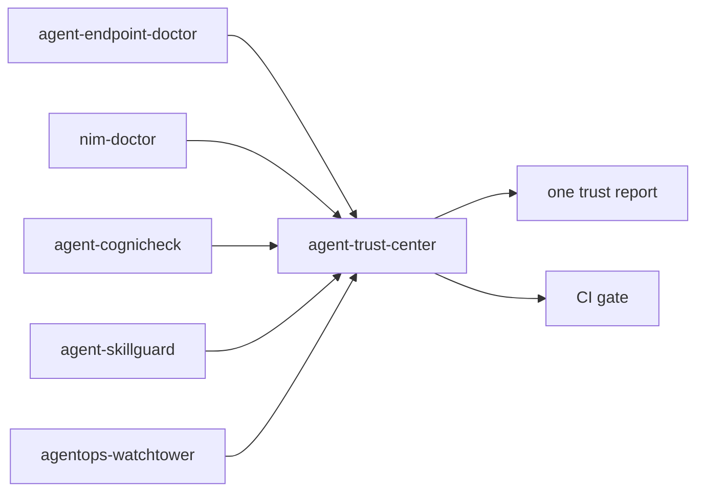

# Agent Trust Center

One local report for AI agent trust evidence.

```bash
npx agent-trust-center demo
```

Agent tools are now spread across endpoint checks, NIM/provider checks, cognitive attack tests, skill admission, MCP safety, and runtime Watchtower traces. Each tool can be useful alone, but teams still need one simple answer before a merge or rollout:

> Can this agent workspace be trusted right now?

Agent Trust Center imports normalized evidence from the companion tools and emits one Markdown, HTML, and JSON trust report plus a CI gate.



## Why It Exists

Agent security is not one scan. Real agent rollouts combine:

- endpoint compatibility: does the OpenAI-compatible model actually support chat, streaming, tools, JSON, and responses APIs?
- cognitive/tool attack tests: can tools resist prompt-injection style misuse?
- skill admission: can AI agent skills be installed safely?
- runtime evidence: did the agent combine tools into risky chains?
- CI governance: should this PR be allowed, reviewed, or blocked?

Agent Trust Center does not replace those tools. It is the local evidence orchestrator that turns them into one decision.

## Quick Start

```bash
npx agent-trust-center demo
npx agent-trust-center profile
npx agent-trust-center gate --fail-on review
```

The demo writes:

```text
.trust-center/
  evidence/
  reports/
    agent-trust-report.json
    agent-trust-report.md
    agent-trust-report.html
```

## Real Workflow

Run the individual tools, generate their normalized evidence, then collect:

```bash
npx agent-skillguard demo
npx agent-skillguard evidence

npx agentops-watchtower demo
npx agentops-watchtower evidence

npx agent-cognicheck demo
npx agent-cognicheck evidence

npx nim-doctor demo
npx nim-doctor evidence

npx agent-endpoint-doctor demo
npx agent-endpoint-doctor evidence

npx agent-trust-center collect
npx agent-trust-center report
npx agent-trust-center gate --fail-on review
```

You can also import explicit files:

```bash
npx agent-trust-center import \
  .skillguard/reports/trust-evidence.json \
  .watchtower/reports/trust-evidence.json
npx agent-trust-center report
```

## Evidence Contract

Every companion tool emits the same local JSON shape:

```json
{
  "schemaVersion": "agent.trust.evidence.v1",
  "tool": { "name": "agent-skillguard", "version": "1.0.0" },
  "subject": { "type": "skill", "name": "code-reviewer" },
  "decision": "allow",
  "score": 0,
  "generatedAt": "2026-05-30T00:00:00.000Z",
  "findings": [],
  "artifacts": [],
  "recommendations": []
}
```

Score is normalized as risk: `0` is clean, `100` is worst. Compatibility tools convert readiness into risk with `100 - readiness`.

## Commands

- `demo`: offline demo with fixture evidence from all five domains.
- `doctor`: check Node, output folder, and local tool availability.
- `import <files...>`: validate and import trust evidence JSON.
- `collect`: collect known local `trust-evidence.json` files from this workspace.
- `report`: generate JSON, Markdown, and HTML trust reports.
- `gate --fail-on review|block`: fail CI when the merged decision reaches the threshold.
- `profile`: print a compact local trust summary.

## GitHub Actions

```yaml
- uses: Gowrav-M/agent-trust-center@v0.1.0
  with:
    evidence: |
      .skillguard/reports/trust-evidence.json
      .watchtower/reports/trust-evidence.json
    fail-on: review
```

See [examples/github-action.yml](examples/github-action.yml).
