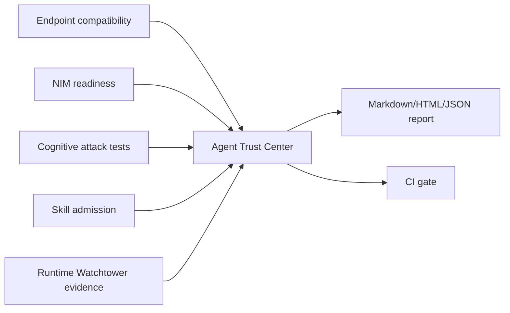

# Trust Workflow

Agent Trust Center is the final local aggregation step.

## Recommended Flow

1. Run each domain tool in the same workspace.
2. Run each tool's `evidence` command.
3. Run `agent-trust-center collect`.
4. Run `agent-trust-center report`.
5. Use `agent-trust-center gate --fail-on review` in CI when you want strict review gates.

## Decision Rules

The merged decision is the worst imported evidence decision:

- any `block` evidence blocks the trust report.
- otherwise any `review` evidence requires review.
- otherwise the report is `allow`.

The merged score is the maximum imported risk score. This keeps one severe domain from being averaged away.
